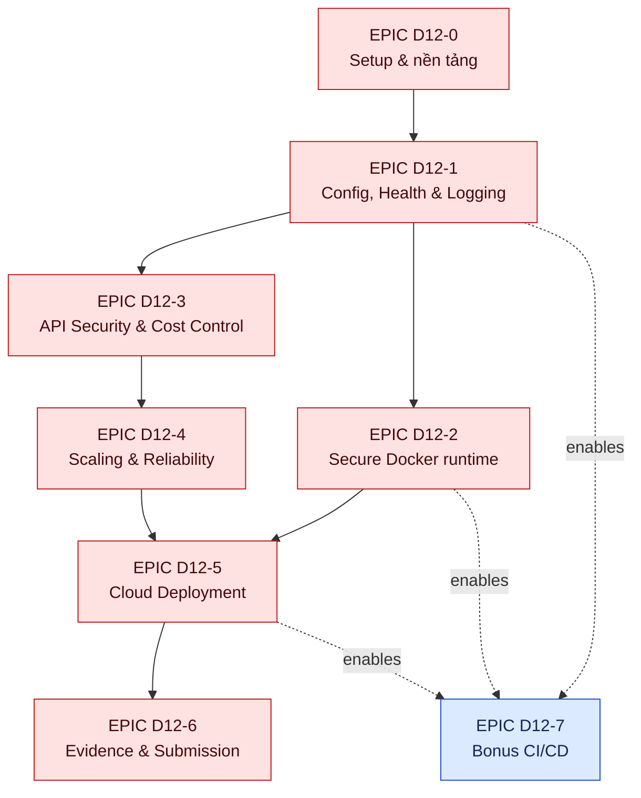
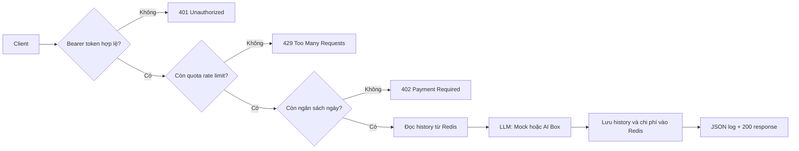
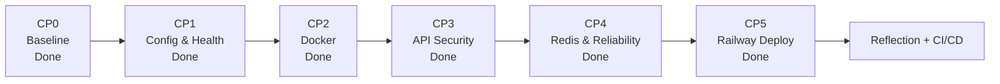
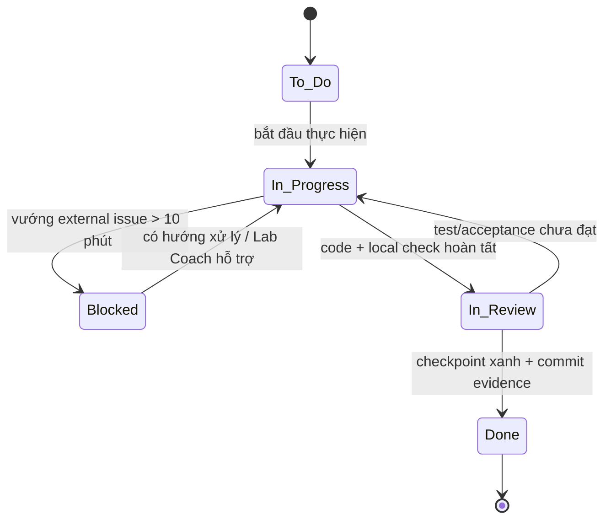

# Jira Plan — Day 12 Cloud Services & Deployment

## Quy ước backlog

- **Project key đề xuất:** `D12`.
- **Trạng thái:** `To Do` → `In Progress` → `In Review` → `Done`; `Blocked` chỉ dùng khi có trở ngại ngoài khả năng xử lý trong 10 phút và cần Lab Coach hỗ trợ.
- **Ưu tiên:** P0 là bắt buộc để đạt checkpoint; P1 là hoàn thiện/nộp bài; P2 là bonus.
- Mỗi issue chỉ đóng khi lệnh kiểm tra trong Acceptance Criteria xanh và code/ghi chú tương ứng đã được commit.

## Quan hệ Epic và phụ thuộc

## Backlog chi tiết

| Key | Loại | Tóm tắt | Ưu tiên | Phụ thuộc | Tiêu chí nghiệm thu |
|---|---|---|---|---|---|
| D12-0 | Epic | Setup & nền tảng | P0 | — | Môi trường sẵn sàng để pytest chạy. |
| D12-1 | Task | Đặt tên repo, tạo venv, cài requirements, tạo `.env` và token | P0 | — | Repo đúng mẫu; `API_TOKEN` tồn tại local; `.env` không được track. |
| D12-2 | Task | Khởi động Redis hoặc cấu hình `fake://` tạm thời | P0 | D12-1 | `docker compose up -d redis` healthy, hoặc fake Redis dùng được cho test non-Docker. |
| D12-3 | Spike | Chạy baseline test và đọc lỗi | P0 | D12-1 | `pytest tests/ -v -m "not docker"` khởi chạy; ghi nhận đây là baseline. |
| D12-10 | Epic | 12-Factor Config, Health & Logging (CP1) | P0 | D12-0 | `pytest tests/test_cp1.py -v` xanh. |
| D12-11 | Story | Externalize và validate config | P0 | D12-1 | `Settings` có 7 trường theo docstring; `api_token` không default và thiếu thì fail fast. |
| D12-12 | Story | Structured JSON logging | P0 | D12-11 | `emit()` ghi đúng một dòng JSON stdout, `severity` uppercase, giữ tiếng Việt. |
| D12-13 | Story | Liveness endpoint | P0 | D12-11 | `GET /healthz` 200 khi normal; không dùng dependency/Redis; 503 khi draining. |
| D12-20 | Epic | Secure Docker Runtime (CP2) | P0 | D12-10 | `pytest tests/test_cp2.py -v` xanh; image dưới 400 MB. |
| D12-21 | Story | Docker multi-stage và cache hiệu quả | P0 | D12-11 | Builder/runtime tách biệt; requirements cài trước khi copy code; image không mang build tool thừa. |
| D12-22 | Story | Harden runtime và build context | P0 | D12-21, D12-13 | Non-root user; healthcheck `/healthz`; Uvicorn `0.0.0.0` và `$PORT`; `.dockerignore` bảo vệ `.env`. |
| D12-23 | Story | Compose chat với Redis | P0 | D12-22, D12-2 | `chat` build/chạy cùng Redis, inject config an toàn, không dùng localhost để trỏ Redis. |
| D12-30 | Epic | API Security & Cost Control (CP3) | P0 | D12-10 | `pytest tests/test_cp3.py -v` xanh. |
| D12-31 | Story | Bearer authentication theo RFC 6750 | P0 | D12-11 | Tách scheme/token; case-insensitive scheme; `compare_digest`; mọi lỗi auth 401 có `WWW-Authenticate: Bearer`. |
| D12-32 | Story | Rate limiting với token bucket | P0 | D12-11, D12-2 | Per-client Redis bucket bắt đầu đầy, refill theo thời gian, cap đúng capacity và persist `tokens` + `ts`. |
| D12-33 | Story | Daily cost guard | P0 | D12-11, D12-2 | Key theo client/ngày; missing key = 0; block trước LLM; tự reset theo ngày. |
| D12-34 | Story | Orchestrate `/chat` | P0 | D12-31, D12-32, D12-33 | Auth → rate limit → budget → history → LLM → history/record/log; response đúng contract. |
| D12-40 | Epic | Scaling & Reliability (CP4) | P0 | D12-30 | `pytest tests/test_cp4.py -v` xanh. |
| D12-41 | Story | Chuyển conversation state sang Redis | P0 | D12-34 | Không còn global in-memory state; history shared; trim giữ message mới nhất và có TTL. |
| D12-42 | Story | Readiness probe | P0 | D12-41 | `/readyz` phản ánh `store.ping()`; Redis lỗi/draining trả 503, exception không thành 500. |
| D12-43 | Story | Graceful draining | P0 | D12-13, D12-42 | SIGTERM/SIGINT bật draining và forward handler cũ của Uvicorn; traffic được rút trước khi dừng. |
| D12-50 | Epic | Cloud Deployment (CP5) | P0 | D12-20, D12-40 | `pytest tests/test_cp5.py -v` xanh; có URL public hoặc fallback có bằng chứng. |
| D12-51 | Task | Provision/deploy Railway hoặc Render | P0 | D12-23, D12-42 | Docker build cloud thành công; secret đặt dashboard; `PORT` không bị override; Redis URL đúng. |
| D12-52 | Task | Smoke test endpoint public | P0 | D12-51 | `/healthz` 200, `/readyz` 200, chat không token 401 và có token 200; burst test có 429. |
| D12-53 | Task | Ghi bằng chứng deploy | P0 | D12-52 | Hoàn tất `DEPLOYMENT.md`, không lộ token; có dashboard và healthz screenshot. |
| D12-60 | Epic | Evidence & Submission | P1 | D12-10, D12-20, D12-30, D12-40, D12-50 | `python grade.py` hoàn thành và bài có thể nộp. |
| D12-61 | Task | Trả lời reflection | P1 | D12-10, D12-20, D12-30, D12-40, D12-50 | Điền cả 10 câu trong `exercises.md` bằng quan sát cá nhân. |
| D12-62 | Task | Final QA và nộp repo | P1 | D12-53, D12-61 | Chạy grade; rà soát `.env`, TODO/`NotImplementedError`, commit history, repo public; push và nộp link LMS. |
| D12-70 | Epic | Bonus CI/CD | P2 | D12-20, D12-50 | `pytest tests/test_bonus_cicd.py -v` xanh. |
| D12-71 | Story | Test/build workflow | P2 | D12-62 | Trigger push/PR `main`; test dùng CI env và bỏ CP5/bonus test; build Docker trên runner. |
| D12-72 | Story | Gated deploy, smoke test và badge | P2 | D12-71 | Deploy `needs: [test, build]`, chỉ push main; secret/variables an toàn; action pinned; `/healthz` smoke test; README badge. |

## Checklist thực thi chi tiết

Mỗi dòng bên dưới là một task có đầu ra kiểm chứng được. Không chuyển task sang `Done` chỉ vì code đã viết; phải chạy lệnh xác nhận của checkpoint tương ứng.

| ID | Checkpoint | Task | Tệp/phạm vi | Xác nhận hoàn tất |
|---|---|---|---|---|
| 0.1 | CP0 | Xác nhận repo đúng tên, branch `main`, `.env` không bị Git theo dõi | Git, `.gitignore` | `git ls-files .env` không có output. |
| 0.2 | CP0 | Dùng venv hiện tại và gọi pytest qua `python -m pytest` nếu launcher bị stale | `.venv` | `python -m pytest --version` chạy được. |
| 0.3 | CP0 | Đặt `API_TOKEN` local và chọn Redis thật hoặc `fake://` cho development | `.env` | App/test import không lỗi do thiếu cấu hình. |
| 0.4 | CP0 | Chạy baseline và lưu trạng thái lỗi ban đầu | `tests/` | `python -m pytest tests/ -v -m "not docker"` khởi chạy. |
| 1.1 | CP1 | Khai báo bảy trường `Settings`: port, api token, Redis URL, bucket capacity, refill rate, daily budget, log level | `app/config.py` | Biến môi trường được parse đúng kiểu. |
| 1.2 | CP1 | Bắt buộc `API_TOKEN` không có default để fail fast | `app/config.py` | Không có `API_TOKEN` gây `ValidationError`. |
| 1.3 | CP1 | Tạo `emit()` xuất một dòng JSON UTF-8 có `event`, `severity`, `ts` và fields bổ sung | `app/logging_utils.py` | Severity viết hoa; log hợp lệ và không indent. |
| 1.4 | CP1 | Cài `/healthz` không nhận dependency; trả 200 khi bình thường và 503 khi draining | `app/main.py` | Không chạm Redis; response đúng contract. |
| 1.5 | CP1 | Chạy checkpoint và chỉ sửa theo failure report | `tests/test_cp1.py` | `python -m pytest tests/test_cp1.py -v` xanh. |
| 2.1 | CP2 | Tạo Dockerfile multi-stage `builder`/`runtime` dùng `python:3.11-slim` | `Dockerfile` | Runtime chỉ nhận dependency/artifact cần thiết. |
| 2.2 | CP2 | Tối ưu layer cache: cài requirements trước khi copy source | `Dockerfile` | Sửa code không ép cài lại dependencies. |
| 2.3 | CP2 | Hardening runtime: non-root UID, `HEALTHCHECK`, bind `0.0.0.0`, đọc `${PORT:-8000}` | `Dockerfile` | Image chạy và healthcheck gọi `/healthz`. |
| 2.4 | CP2 | Chặn build context nhạy cảm nhưng giữ file runtime cần thiết | `.dockerignore` | `.env`, `.git`, `.venv`, cache bị loại trừ. |
| 2.5 | CP2 | Hoàn thiện Compose `redis` + `chat`, inject token từ environment, dùng hostname `redis` | `docker-compose.yml` | `chat` depends on Redis và không hard-code secret. |
| 2.6 | CP2 | Build/run image, xác nhận size dưới 400 MB và chạy test | Docker | `python -m pytest tests/test_cp2.py -v` xanh. |
| 3.1 | CP3 | Xác thực RFC 6750: parse Bearer case-insensitive, constant-time compare, 401 thống nhất | `app/auth.py` | Tất cả 401 có `WWW-Authenticate: Bearer`. |
| 3.2 | CP3 | Lưu token bucket theo client trong Redis: khởi tạo đầy, refill theo thời gian, cap capacity, persist `tokens` + `ts` | `app/rate_limiter.py` | Hết bucket trả 429 kèm retry information. |
| 3.3 | CP3 | Theo dõi spend theo key client/ngày; chặn trước LLM và chỉ record sau lượt thành công | `app/cost_guard.py` | Vượt budget trả 402, ngày mới tự reset. |
| 3.4 | CP3 | Phối hợp `/chat`: auth → rate limit → budget → history → mock LLM → store/record/log | `app/main.py` | 200 response có đúng five fields/usage contract; body sai là 422. |
| 3.5 | CP3 | Chạy checkpoint API security | `tests/test_cp3.py` | `python -m pytest tests/test_cp3.py -v` xanh. |
| 4.1 | CP4 | Lưu lịch sử `chat:<client>` trong Redis, trim message mới nhất, đặt TTL và ping không ném exception | `app/store.py` | State không nằm trong global process memory. |
| 4.2 | CP4 | Cài `/readyz`: Redis sống 200, Redis lỗi/draining 503 | `app/main.py` | Readiness không tạo HTTP 500. |
| 4.3 | CP4 | Arm SIGTERM/SIGINT: bật draining và forward handler Uvicorn cũ | `app/lifecycle.py` | Cả probes trả 503 trong draining. |
| 4.4 | CP4 | Chạy checkpoint reliability | `tests/test_cp4.py` | `python -m pytest tests/test_cp4.py -v` xanh. |
| 5.1 | CP5 | Khi CP1–CP4 xanh, provision Railway project/service + Redis và deploy từ Dockerfile | Railway | `PORT` do Railway cấp; Redis tạo `REDIS_URL`. |
| 5.2 | CP5 | Đặt cloud variables qua dashboard: `API_TOKEN`, bucket/refill/budget/log level; không commit giá trị | Railway Variables | Secret không xuất hiện trong repo/tài liệu/log. |
| 5.3 | CP5 | Tạo domain và smoke test public `/healthz`, `/readyz`, chat 401, chat 200 và burst 429 | Public URL | HTTPS endpoints trả đúng status. |
| 5.4 | CP5 | Điền dữ liệu thật vào `DEPLOYMENT.md`, thêm dashboard/healthz screenshots | Docs, `screenshots/` | Không còn placeholder và không lộ token. |
| 5.5 | CP5 | Chạy checkpoint deploy | `tests/test_cp5.py` | `python -m pytest tests/test_cp5.py -v` xanh. |
| 6.1 | Nộp bài | Tự trả lời 10 reflection bằng quan sát khi chạy bài | `exercises.md` | `grade.py` ghi nhận đủ 10 câu. |
| 6.2 | Nộp bài | Final QA: grade, secret scan, không còn TODO/NotImplementedError, kiểm tra lịch sử commit | Toàn repo | `python grade.py --no-bonus` và checklist nộp bài đạt. |
| 7.1 | Bonus | Tạo workflow test + Docker build trên push/PR main, dùng CI env và bỏ CP5/bonus tests | `.github/workflows/ci.yml` | Job test/build xanh. |
| 7.2 | Bonus | Gated Railway deploy chỉ ở push main, dùng GitHub Secrets/Variables, smoke test và README badge | CI/CD + README | `python -m pytest tests/test_bonus_cicd.py -v` xanh. |

## Tiến độ thực tế

| Hạng mục | Trạng thái | Bằng chứng / việc còn lại |
|---|---|---|
| CP0 — Setup & baseline | Done | Venv và pytest chạy; `.env` được Git ignore; Redis PING thành công; thu thập 101 test non-Docker. |
| CP1 — Config, health & logging | Done | `python -m pytest tests/test_cp1.py -v` → 13 passed; commit `4ac68e7`. |
| Cấu hình AI Box / DeepSeek | Done (tùy chọn) | Provider mặc định là `mock`; chỉ bật AI Box bằng `LLM_PROVIDER=ai_box` cùng `AI_BOX_API_KEY` trong `.env`/Railway Variables. Chưa gọi API thật vì chưa có key. |
| CP2 — Docker/Compose | Done | `python -m pytest tests/test_cp2.py -v` → 16/16 passed, gồm build image và kiểm tra kích thước dưới 400 MB. |
| CP3 — Bảo mật API & cost control | Done | CP3 có 29/29 passed; regression CP1–CP3 có 58/58 passed, gồm Docker build thật. |
| CP4 — Scaling & reliability | Done | `LLM_PROVIDER=mock python -m pytest tests/test_cp4.py -v` → 19/19 passed; đã tạo commit checkpoint. |
| CP5 — Railway deployment | Done | Public URL hoạt động; CP5 có 9 passed, 4 skipped; đã ghi bằng chứng vào `DEPLOYMENT.md`. |
| Reflection, CI/CD | In Review | Bonus workflow đã viết; cần push lên GitHub và khai báo `RAILWAY_TOKEN`, `RAILWAY_PROJECT_ID`, `PUBLIC_URL` để chạy deploy job thật. |

## Sơ đồ nhanh để review

### Luồng một request `/chat`

### Đường đi checkpoint

## Kế hoạch thực thi theo checkpoint

```mermaid
gantt
    title Day 12 execution plan
    dateFormat  HH:mm
    axisFormat %H:%M
    section Mandatory
    CP0 Setup & baseline                 :crit, p0, 14:00, 20m
    CP1 Config, health, logging          :crit, p1, after p0, 40m
    CP2 Docker hardening                 :crit, p2, after p1, 45m
    Break                                :milestone, 15:45, 10m
    CP3 Auth, rate limit, cost guard     :crit, p3, 15:55, 45m
    CP4 Redis state & reliability        :crit, p4, after p3, 40m
    CP5 Cloud deployment & evidence      :crit, p5, after p4, 30m
    Reflection & final QA                :crit, p6, after p5, 10m
    section Optional
    CI/CD                                :bonus, after p6, 40m
```

## Theo dõi checkpoint

| Checkpoint | Phạm vi hoàn thành | Lệnh xác nhận | Trạng thái hiện tại |
|---|---|---|---|
| CP0 — Setup & baseline | Venv, dependencies, `.env` an toàn và baseline test chạy được | `python -m pytest tests/ -v -m "not docker"` | Done — repo/branch đúng, `.env` được ignore và có config; Redis PING thành công; pytest thu thập 101 test non-Docker. |
| CP1 — Config, health & logging | `Settings`, JSON stdout logging, `GET /healthz` | `python -m pytest tests/test_cp1.py -v` | Done — 13/13 test pass; đã tạo commit checkpoint. |
| CP2 — Secure Docker runtime | Docker multi-stage, non-root, healthcheck, Compose + Redis | `python -m pytest tests/test_cp2.py -v` | Done — 16/16 test pass, gồm build image và kiểm tra kích thước. |
| CP3 — API security & cost control | Bearer auth, token bucket, daily budget, `/chat` orchestration | `python -m pytest tests/test_cp3.py -v` | Done — 29/29 test pass khi override tạm `LLM_PROVIDER=mock`; regression CP1–CP3 đạt 58/58. |
| CP4 — Scaling & reliability | Redis conversation state, `/readyz`, graceful draining | `python -m pytest tests/test_cp4.py -v` | Done — 19/19 test pass khi override tạm `LLM_PROVIDER=mock`; đã tạo commit checkpoint. |
| CP5 — Cloud deployment | Railway/Render, public smoke test, `DEPLOYMENT.md`, screenshots | `python -m pytest tests/test_cp5.py -v` | Done — Railway public smoke test 9 passed, 4 skipped; deployment evidence đã ghi lại. |
| Reflection | Hoàn tất 10 câu trả lời cá nhân trong `exercises.md` | `python grade.py --no-bonus` | To Do |
| Bonus — CI/CD | GitHub Actions: test, Docker build, gated deploy, README badge | `python -m pytest tests/test_bonus_cicd.py -v` | In Review — 11/11 kiểm tra cấu trúc pass; 2 kiểm tra badge chờ workflow chạy trên GitHub. |

**Quy tắc chuyển checkpoint:** chỉ chuyển sang `In Review` khi lệnh xác nhận của checkpoint xanh; sau đó tạo commit độc lập theo checkpoint trước khi đánh dấu `Done`.

## Workflow trạng thái Jira

## Definition of Done

Một issue được xem là Done khi:

- Đã đạt toàn bộ acceptance criteria ở bảng backlog.
- Đã chạy test checkpoint liên quan và lưu lại kết quả phù hợp.
- Không thêm secret vào source, Docker image, tài liệu hoặc workflow.
- Có commit độc lập, thông điệp phản ánh rõ nội dung thay đổi.
- Với issue deploy: bằng chứng trong `DEPLOYMENT.md` và `screenshots/` đã đầy đủ.

## Rủi ro và cách xử lý

| Rủi ro | Dấu hiệu | Xử lý / issue liên quan |
|---|---|---|
| Thiếu `API_TOKEN` | `ValidationError` khi start | D12-11: tạo `.env`, set secret trên cloud/CI phù hợp. |
| Redis không kết nối | `/readyz` 503, connection error | D12-2/D12-42: kiểm tra URL, Compose service hoặc add-on. |
| Container không gọi được | health check timeout | D12-22: bind `0.0.0.0`, dùng `$PORT`, đọc `docker compose logs chat`. |
| Image quá lớn | >400 MB | D12-21: xác nhận runtime slim và chỉ copy artifact từ builder. |
| Deploy cloud bị chặn | Không tạo được tài khoản/thẻ/mạng | D12-50: dùng `LOCAL_FALLBACK=true`, ghi lý do và ảnh; chấp nhận trần 9/15 CP5. |
| CI deploy sai thời điểm | Deploy chạy trên PR hoặc trước test | D12-72: dùng `needs` và điều kiện push vào `main`. |
